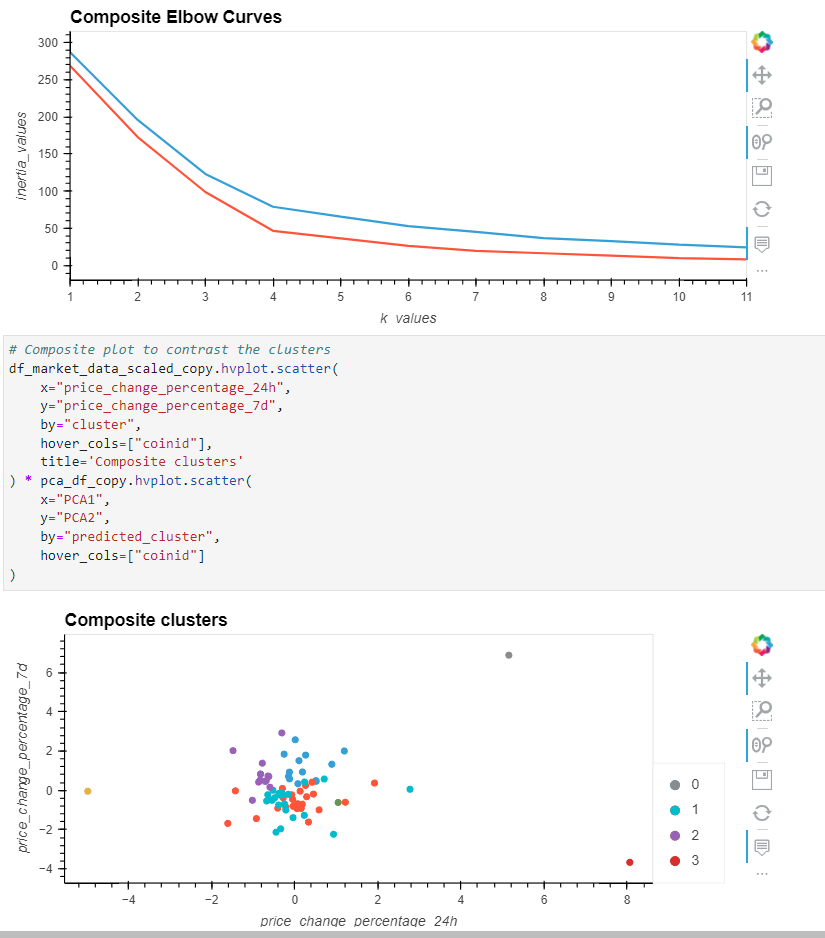

# Unsupervised Machine Learning

Using Python and unsupervised learning to predict if cryptocurrencies are affected by 24-hour or 7-day price changes   

### File/directory structure
📦CryptoClustering   
 ┣ 📂Resources   
 ┃ ┗ 📜crypto_market_data.csv   
 ┣ 📜Crypto_Clustering.ipynb   
 ┣ 📜screenshot.png    
 ┗ 📜README.md
 
